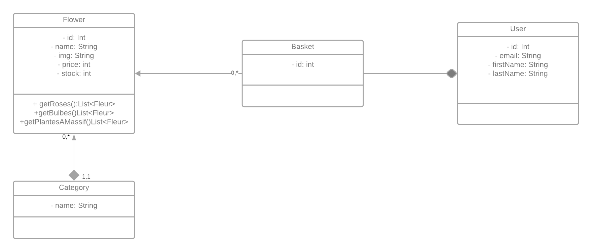

# Projet Web

## Front  
Le front utilise React : 
Pour lancer le serveur React : 
```
cd front
npm install 
npm run dev
```


## Back
Le back utilise Django (Rest) :
Pour installer les dependances :
```
cd back
python -m venv ./     
pip install -r requirements.txt
```

Une fois que les dépendances sont installées :

Actualiser la base de donnés:
```
python manage.py migrate
```

Pour lancer le server Rest :
```
python manage.py runserver
```

### API
#### Spécifications de l'API


Si l'utilisateur est connecté:  

**GET :**  
- `/flowers/rosiers` : Renvoie une liste de tous les rosiers
- `/flowers/bulbes` : Renvoie une liste de tous les bulbes
- `/flowers/plantesAMassif`: Renvoie une liste de toutes les plantes à massif
- `/me` : Renvoie les informations de l'utilisateur
- `/user/basket` : Renvoie le panier de l'utilisateur
- `/logout` : Déconnecte l'utilisateur

**PATCH/PUT :**  
- `/user/basket` : Mets à jour le panier de l'utilisateur  
    Exemple de requête :   
    _{  
        "userId" : "1",  
        "flowers": [listeDefleur]  
      }_
- `/flowers/{id}/stock` : Mets à jour le stocks des fleurs
  Exemple de requête :   
  _{  
  "flowerId" : "1",  
  "stock": "23"  
  }_

Si l'utilisateur n'est pas connecté:  

- `/login` : Renvoie une page web sur laquelle l'utilisateur peut se connecter  

#### Structure UML

