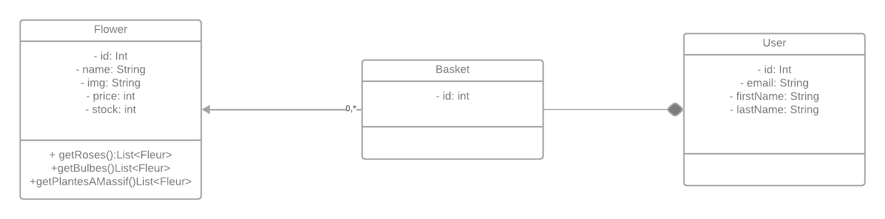

# Partie front du projet  
## Installation et configuration
Le projet nécéssite node 20.11.0 : https://nodejs.org/en  
```bash
npm install 
npm run dev
```
## Contribution  
Toute contribution sur cette partie du projet doit être push sur la branche dev-front  
La maquette du projet est disponible ici : https://www.figma.com/file/okdPeT38JNUiCvKdeJJ226/Untitled?type=design&node-id=0%3A1&mode=design&t=wTKwFAu0rvgtrEsZ-1  

### Sources  
Les fichier sources sont contenue dans le répertoire ``src/``.  
Chaque composant React doit posséder sont propres dossier qui porte sont nom dans le répertoire ``src/components/``.  
Les images doivent être présente dans le répertoire ``src/assets/images/``.  

### API
#### Spécifications de l'API


Si l'utilisateur est connecté:  

**GET :**  
- `/flowers/rosiers` : Renvoie une liste de tous les rosiers
- `/flowers/bulbes` : Renvoie une liste de tous les bulbes
- `/flowers/plantesAMassif`: Renvoie une liste de toutes les plantes à massif
- `/me` : Renvoie les informations de l'utilisateur
- `/user/basket` : Renvoie le panier de l'utilisateur
- `/logout` : Déconnecte l'utilisateur

**PATCH/PUT :**  
- `/user/basket` : Mets à jour le panier de l'utilisateur  
    Exemple de requête :   
    _{  
        "userId" : "1",  
        "flowers": [listeDefleur]  
      }_
- `/flowers/{id}/stock` : Mets à jour le stocks des fleurs
  Exemple de requête :   
  _{  
  "flowerId" : "1",  
  "stock": "23"  
  }_

Si l'utilisateur n'est pas connecté:  

- `/login` : Renvoie une page web sur laquelle l'utilisateur peut se connecter  

#### Structure UML

